<!--
SPEAKER NOTES & TIMING (target ~15 min + Q&A)
  1. Title / hook ............ 0:30
  2. The problem ............. 2:00
  3. The hypothesis .......... 1:30
  4. Architecture ............ 2:00
  5. Shape hash & caching .... 1:30
  6. Codegen: state+targets .. 1:30
  7. Tasks: the hybrid ....... 1:30
  --- LIVE DEMO ----------------- 4:00  (slides 8–10 are demo cues)
  8. Numbers ................. (covered in demo)
  9. Limitations ............. 1:00
 10. Roadmap / the ask ....... 0:30
Keep the demo pre-warmed. Don't show cold gen live.
-->

# B#
## Compiling a closed-world subset of MSBuild to a native build host

**Simon Rozsival** · research playground · proof-of-concept

<!--
HOOK: "What if `dotnet build` on an unchanged project could be a single fast
native binary instead of re-evaluating all of MSBuild every time? B# is a small
experiment poking at that question." Set expectation up front: this is a
vibecoded proof-of-concept, NOT an MSBuild replacement. MSBuild is mature and
handles enormously diverse scenarios; B# only handles a trivial console app.
-->

---

## The problem: we re-pay for MSBuild's dynamism every build

Even a trivial `net11.0` console app, **every** invocation:

- Re-evaluates the whole shape — project + full SDK closure
- **~500 targets · 199 `UsingTask`s · 14 assemblies** — for Hello World
- Dynamic dicts · reflection-loaded tasks · runtime topo-sort
- CoreCLR + JIT cold start

<!--
This audience knows this cold. Land the point: almost none of this changes
between edits to Program.cs. We recompute it anyway. ~735 props, ~400 item types.
-->

---

## The hypothesis: the *shape* is a compile-time constant

- Inner loop: **source** changes constantly, **shape** almost never
- So evaluation + DAG + task binding = **redundant work**

**The experiment:** evaluate the shape once → **code-generate specialized C#**
→ **NativeAOT-compile** a per-project build binary.

*A toy, not a product. How far does it get before the real world breaks it?*

<!--
"AOT / source-generation, pointed at the build itself." Inner-loop = edit source,
rebuild. The shape (props, DAG, task bindings) is fixed → precompute it.
-->

---

## Architecture: compile the build, then run it (two phases)



<!--
The generator is NOT on the hot path. You run it like a compiler when the shape
changes; the inner loop runs `.bsharp/build` directly. The task server is copied
into `.bsharp/` so the whole folder is self-contained — no BSHARP_TASKD_PATH.
Frontend is the evaluation API directly — NOT -pp preprocess, NOT binlog.
-->

---

## Shape hash: when do you re-compile the build?

The generator hashes the **shape**:

- `.csproj` · imported `.props`/`.targets` · `ProjectReference`s
- `Directory.Build.*` · `Directory.Packages.props` · `global.json`
- lock / assets files · `-p:X=Y` globals

**Source edit → run `.bsharp/build`.  Shape edit → regenerate.**

<!--
Like a compile-time constant: when it changes, you recompile. Internal
ShapeHashVersion bumps force regen. Global-property variants isolated in
variants/<hash>/, per-TFM inner/<tfm>/.
-->

---

## Codegen: baked state + targets as methods

- Properties → **typed static fields** (`P.Configuration = "Debug"`)
- Items → **typed lists** (`I.*`)
- Target → **`async ValueTask`** + execute-once guard; deps expanded at codegen
- Dynamic `Targets.Run(string)` dispatcher → often **never emitted**
- **Fast no-op:** timestamp check, returns before any target runs

<!--
~42k lines of generated C# for the console host; trimmer prunes the rest.
Runtime paths filled in InitialState.Populate. Literal DependsOn/BeforeTargets →
Task.WhenAll batches. DependsOnTargets="$(Prop)" resolved when Prop never mutated.
-->

---

## Tasks: the NativeAOT / CoreCLR hybrid

- **Structural tasks → compiled into the host** (no IPC)
  `Copy` · `Delete` · `WriteLinesToFile` · `Message` · `Exec` · `Csc`-wrapper …
- **Real SDK `UsingTask`s → CoreCLR task server** over JSON/IPC
  `Csc` · `ResolvePackageAssets` · `GenerateDepsFile` …

> NativeAOT can't load task assemblies dynamically → isolate that in CoreCLR,
> keep the host AOT-clean and fast to start.

<!--
Structural tasks have a narrow task-batching subset (one metadata dimension,
per-batch conditions), sequential to keep MSBuild semantics. UsingTasks
serialized as TaskInvocation, typed by TaskModel.cs, persistent server.
-->

---

## 🔴 LIVE DEMO — setup

```bash
demo-cd                       # fixtures/console-net11
cat console-net11.csproj      # plain SDK console app
cat Program.cs                # Hello 9

ls .bsharp/                   # generated host + BUNDLED task server
ls .bsharp/bin/.../publish/ | grep bsharp-taskd   # self-contained
wc -l .bsharp/Program.cs      # ~42k lines of specialized C#
head .bsharp/tasks.report.txt # 199 UsingTasks, 14 assemblies
```

<!--
DEMO is pre-compiled. Talk track: "Nothing B#-specific in the project. The
generator turned this one trivial app into a 42k-line host plus a bundled task
server." Keep it moving — and keep reminding the room this only works because the
app is trivial.
-->

---

## 🔴 LIVE DEMO — an early timing, for one trivial app

```bash
echo "== dotnet ==";  t-dotnet      # ~1.0 s warm no-op (--no-restore)
echo "== .bsharp/build ==";  t-build # ~57 ms — the compiled build, run directly

# incremental edit
sed -i '' 's/Hello 9/Hello, B#!/' Program.cs
time ./.bsharp/build --no-restore -v:quiet build   # ~150 ms vs dotnet ~990 ms
./.bsharp/build run -v:quiet                        # Hello, B#!
```

| no-op | dotnet `--no-restore` ~1.0 s · **`.bsharp/build` ~57 ms (~18×)** |
|---|---|
| **incremental** | dotnet ~0.99 s · **`.bsharp/build` ~150 ms (~6.7×)** |

<!--
Be explicit and humble: this is NOT apples-to-apples. dotnet build is doing far
more — globbing, full incremental correctness, diverse project types — and B#
sidesteps most of it by only handling this one trivial shape. The number is what
a stripped-down specialized binary can do, not proof B# "beats" MSBuild.
-->

---

## Early timings — one trivial console app

median ms, ~20 runs. Baseline = `dotnet build` (restore on). **Not apples-to-apples.**

| Scenario | `.bsharp/build` (best) | vs dotnet (no-restore) | vs dotnet (restore-on) |
|---|---:|---:|---:|
| **noop** | **57** | 1014 → ~18× | 1534 → ~27× |
| **incremental** | **138** | 994 → ~7× | 1522 → ~11× |
| **clean** | **342** | — | 1558 → ~4.5× |
| **restore** | **245** | — | 1020† → ~4.2× |

† vs `dotnet restore`. Ratios come **entirely from doing less** · + one-time ~30–80 s publish.

<!--
Say it out loud: MSBuild earns its cost — correct across a huge matrix of project
types. B# is fast because it's a specialized binary for ONE trivial app. Existence
proof, not a benchmark victory. noop best = no-restore fast-noop; clean = fast-restore.
-->

---

## 🔴 LIVE DEMO — reasoning about a shape

```bash
gen-bsharp audit | head -40
```

- Evaluates the project and reports the **shape** as JSON — targets, tasks,
  `CallTarget`/`<MSBuild>` sites, dynamic imports, `UsingTask` issues
- **No host generated** — this is the bring-up / triage tool for bigger SDKs

<!--
This is how we decide whether MAUI fits the subset yet. Optional: touch the
csproj to show the GENERATOR's shape-hash invalidation → regen; source edit → no
regen, just re-run .bsharp/build.
-->

---

## Be honest about the numbers

- **Not a fair fight, on purpose** — speedup is bought by **doing less**
- **Missing functionality?** maybe the build now skips something important — but
  it builds & runs, so maybe it wasn't important here in the first place?
- Broad across these scenarios (~4–27×) — but **only this one app**
- **Tradeoff:** compiled for a *fixed shape*; shape change → regenerate
- Fast-noop / fast-restore are timestamp-based + conservative
- One-time ~30–80 s NativeAOT publish per shape
- macOS noise → **median**, trust ratios not absolutes

<!--
MSBuild is mature and correct across a huge range; B# handles one trivial shape
and skips almost everything else. A `touch` rebuilds; source edits never wrongly
skipped (verified). Shape = csproj / Directory.Build.* / global.json / -p globals.
-->

---

## Known limitations

- **Closed-world subset** — out-of-subset shapes rejected, never approximated
- Works today: **console apps + class libraries**, `net11.0`
- Not yet: **MAUI / Blazor**, `watch`, target batching, package-supplied targets
- macOS arm64 / .NET 11 preview only

<!--
Out-of-subset → diagnostic or shim, never silently wrong. Also: inline UsingTask
factories, some restore/assets-file shortcuts, cache-invalidation gaps.
-->

---

## Where this experiment is honestly at

**Works:** runnable binary for console apps + class libs, run directly as a
self-contained `.bsharp/build`.

**Open / hard:**
- Shape-change detection on the hot path
- Shrink the one-time publish cost
- Broaden the subset — **MAUI is a distant north star, not a plan**
- Correctness oracle vs stock MSBuild (almost none today)

**The ask:** worth poking at further? "Probably not, because…" welcome.

<!--
Curiosity-driven experiment about how much of a build is a compile-time constant
— not a proposal to replace anything. R2R-only host + background regen prototyped.
-->

---

## Thanks — questions?

- Repo: `simonrozsival/bsharp`  ·  gist: https://gist.github.com/simonrozsival/8f252e57a06dc2e11ae7a51c9a0473b2
- `README.md` + `DESIGN.md` §0 = current design summary
- Try it: `./build.sh` → `bsharp build` once, then `./.bsharp/build run` in `fixtures/console-net11`

<!--
Likely Qs: cold cost (one-time, cached) · correctness vs MSBuild (subset +
gated E2E corpus) · why not cache evaluation instead (we cache the *compiled*
build, not just eval) · MAUI (audit-driven bring-up, not there yet).
-->
